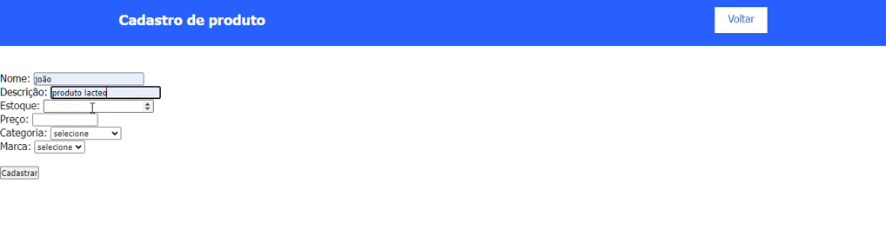
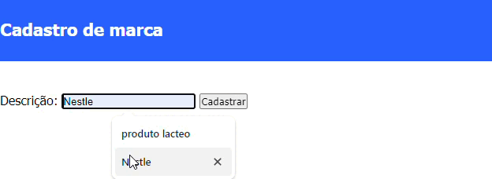

# 🚀 Sejam todos bem-vindos ao meu repositório Cad_Ecommerce
 
## Índice
   - [Descrição](#-descri%C3%A7%C3%A3o)
   - [Introdução](#-introdu%C3%A7%C3%A3o)
   - [Funcionalidades](#funcionalidades)
   - [Tecnologias Utilizadas](#tecnologias-utilizadas)
   - [Fontes Consultadas](#fontes-consultadas)
   - [Autores](#autores)
   - [Métodos PHP Utilizados](#m%C3%A9todos-php-utilizados)
 
 
# ✅ Descrição 
Este código foi desenvolvido para demonstrar a configuração e utilização de uma conexão de banco de dados MySQL utilizando PHP. Ele faz parte do projeto Cad_Ecommerce.
 
# 📃 Introdução
 
Neste repositório, você encontrará exemplos de como configurar a conexão com o banco de dados, criar tabelas, e realizar operações CRUD (Create, Read, Update, Delete) usando PHP e MySQL.
 
## 🔧 Funcionalidades
   ° Configuração de conexão com banco de dados MySQL.
   ° Criação de tabelas no banco de dados.
   ° Inserção, leitura, atualização e exclusão de dados nas tabelas.
 
## as linguagens utilizadas servem para:
 
   config.php: Arquivo de configuração da conexão com o banco de dados.
   categoria.php: Gerenciamento de categorias.
   marca.php: Gerenciamento de marcas.
   produto.php: Gerenciamento de produtos.
   pedido.php: Gerenciamento de pedidos.
   carrinho.php: Gerenciamento do carrinho de compras.
 
## 📌 Tecnologias Utilizadas

   ° HTML5    
   ° CSS   
   ° PHP   
   ° MySQL
 
## Métodos PHP Utilizados

## `produtos.php`



```php
   <?php
    // Inclui o arquivo de conexão com o banco de dados
    include_once('controller/conexao.php');
?>
<!DOCTYPE html>
<html lang="en">
<head>
    <meta charset="UTF-8">
    <meta http-equiv="X-UA-Compatible" content="IE=edge">
    <meta name="viewport" content="width=device-width, initial-scale=1.0">
    <title>Cadastro de produtos</title>
    <!-- Inclui o arquivo CSS para estilização -->
    <link rel="stylesheet" href="css/style.css">
</head>
<body>
    <header>
        <div class="center">
            <h1>Cadastro de produto</h1>
            <!-- Link para voltar à página inicial -->
            <a href="index.php" target="_self">Voltar</a>
        </div>
    </header>
    <section id="produtos">
        <!-- Formulário para cadastro de produto -->
        <form action="insere-produto.php" method="post">
            <!-- Campo para o nome do produto -->
            Nome: <input type="text" name="nome"><br>
            <!-- Campo para a descrição do produto -->
            Descrição: <input type="text" name="descricao"><br>
            <!-- Campo para a quantidade em estoque do produto -->
            Estoque: <input type="number" name="estoque"><br>
            <!-- Campo para o preço do produto -->
            Preço: <input type="number" name="preco" min="0.00" max="10000.00" step="0.01"><br>
            <!-- Campo de seleção para a categoria do produto -->
            Categoria:
            <select name="seleciona_categoria" id="">
                <option value="">Selecione</option>
                <?php
                    // Consulta todas as categorias no banco de dados
                    $resultado_categoria = "SELECT * FROM categoria";
                    $resultadocategoria = mysqli_query($mysqli, $resultado_categoria);
                    // Preenche as opções do select com as categorias
                    while($row_categorias = mysqli_fetch_assoc($resultadocategoria)){ ?>
                    <option value="<?php echo $row_categorias['IDCATEGORIA'] ?>">
                    <?php echo $row_categorias['DESCRICAO'] ?></option>
                <?php
                    }
                ?>
            </select>
            <br>
            <!-- Campo de seleção para a marca do produto -->
            Marca:
            <select name="seleciona_marca" id="">
                <option value="">Selecione</option>
                <?php
                    // Consulta todas as marcas no banco de dados
                    $resultado_marca = "SELECT * FROM marca";
                    $resultadomarca = mysqli_query($mysqli, $resultado_marca);
                    // Preenche as opções do select com as marcas
                    while($row_marcas = mysqli_fetch_assoc($resultadomarca)){ ?>
                    <option value="<?php echo $row_marcas['IDMARCA'] ?>">
                    <?php echo $row_marcas['DESCRICAO'] ?></option>
                <?php
                    }
                ?>
            </select>
            <br><br>
            <!-- Botão para enviar o formulário -->
            <input type="submit" value="Cadastrar">
        </form>
    </section>
</body>
</html>
```
## `insere-produto.php`
```php
    <?php
    // Inclui o arquivo de conexão com o banco de dados
    include_once('controller/conexao.php');
    
    // Recebe os dados do formulário
    $categoria      = $_POST['seleciona_categoria'];
    $marca          = $_POST['seleciona_marca'];
    $nome_produto   = $_POST['nome'];
    $descricao      = $_POST['descricao'];
    $estoque        = $_POST['estoque'];
    $preco          = $_POST['preco'];           
    
    // Insere os dados na tabela de produtos
    $grava_produto = "INSERT INTO produtos(IDCATEGORIA, IDMARCA, NOME, DESCRICAO, ESTOQUE, PRECO) VALUES ('$categoria', '$marca', '$nome_produto', '$descricao', '$estoque', '$preco')";
    $result_gravacao = mysqli_query($mysqli, $grava_produto);
    
    // Verifica se a gravação foi bem-sucedida e exibe uma mensagem de alerta
    if(mysqli_affected_rows($mysqli) != 0){
        echo"
        <META HTTP-EQUIV=REFRESH CONTENT = '0,URL=produtos.php'>
        <script type=\"text/javascript\">
        alert('Produto cadastrado com sucesso');
        </script>
        ";
    } else {
        echo"
        <META HTTP-EQUIV=REFRESH CONTENT = '0,URL=produtos.php'>
        <script type=\"text/javascript\">
        alert('Produto não cadastrado');
        </script>
        ";
    }
?>
```
## `marca.php`  



```php
    <!DOCTYPE html>
<html lang="en">
<head>
    <meta charset="UTF-8">
    <meta http-equiv="X-UA-Compatible" content="IE=edge">
    <meta name="viewport" content="width=device-width, initial-scale=1.0">
    <title>Cadastro de marca</title>
    <!-- Inclui o arquivo CSS para estilização -->
    <link rel="stylesheet" href="css/style.css">
</head>
<body>
    <header>
        <div>
            <h1>Cadastro de marca</h1>
            <!-- Link para voltar à página inicial -->
            <a href="index.php" target="_self">Voltar</a>
        </div>
    </header>
    <section id="produtos">
        <!-- Formulário para cadastro de marca -->
        <form action="insere-marca.php" method="post">
            <!-- Campo para a descrição da marca -->
            <label for="">Descrição: </label>
            <input type="text" name="descricao">
            <!-- Botão para enviar o formulário -->
            <input type="submit" value="Cadastrar">
        </form>
    </section>
</body>
</html>
```
## `insere-marca.php`
```php
    <?php
    // Inclui o arquivo de conexão com o banco de dados
    include('controller/conexao.php');
    
    // Recebe os dados do formulário
    $descricao = $_POST['descricao'];
    echo "<h3>Descrição: $descricao </h3></br>";
    
    // Insere os dados na tabela de marcas
    $cad_marca = "INSERT INTO marca(DESCRICAO) VALUES ('$descricao')";
    
    // Verifica se a gravação foi bem-sucedida e exibe uma mensagem de sucesso ou erro
    if(mysqli_query($mysqli, $cad_marca)){
        echo "<h1>Marca cadastrada com sucesso!</h1></br>";
    } else {
        echo "Erro: ". $cad_marca. "</br>". mysqli_error($mysqli);
    }
    
    // Fecha a conexão com o banco de dados
    mysqli_close($mysqli);
?>
```
## `categoria.php`


```php
    <!DOCTYPE html>
<html lang="en">
<head>
    <meta charset="UTF-8">
    <meta http-equiv="X-UA-Compatible" content="IE=edge">
    <meta name="viewport" content="width=device-width, initial-scale=1.0">
    <title>Cadastro de Categorias</title>
    <!-- Inclui o arquivo CSS para estilização -->
    <link rel="stylesheet" href="css/style.css">
</head>
<body>
    <header>
        <div>
            <h1>Cadastro de Categoria</h1>
            <!-- Link para voltar à página inicial -->
            <a href="index.php" target="_self">Voltar</a>
        </div>
    </header>
    <section id="produtos">
        <!-- Formulário para cadastro de categoria -->
        <form action="insere-categoria.php" method="post">
            <label for="">Descrição: </label>
            <input type="text" name="descricao">
            <input type="submit" value="Cadastrar">
        </form>
    </section>
</body>
</html>
```
## `insere-categoria.php`
```php
    <?php
    // Inclui o arquivo de conexão com o banco de dados
    include('controller/conexao.php');
    
    // Recebe os dados do formulário
    $descricao = $_POST['descricao'];
    echo "<h3>Descrição: $descricao </h3></br>";
    
    // Insere os dados na tabela de categorias
    $cad_categoria = "INSERT INTO categoria(DESCRICAO) VALUES ('$descricao')";
    
    // Verifica se a gravação foi bem-sucedida e exibe uma mensagem de sucesso ou erro
    if(mysqli_query($mysqli, $cad_categoria)){
        echo "<h1>Categoria cadastrada com sucesso!</h1></br>";
    } else {
        echo "Erro: ". $cad_categoria. "</br>". mysqli_error($mysqli);
    }
    
    // Fecha a conexão com o banco de dados
    mysqli_close($mysqli);
?>
```

## 🔎 Fontes consultadas

   [PHP PDO](https://www.php.net/manual/en/book.pdo.php)  
   [MySQL Documentation](https://dev.mysql.com/doc/)  

## ✒️ Autores

[Julia Burque](https://github.com/juliaburque/Cad_Ecommerce) 
